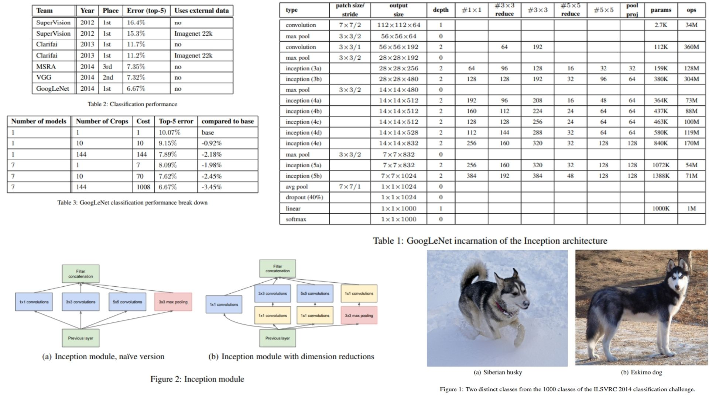

# 🌐 GoogleNet-Replication PyTorch Implementation

This repository contains a PyTorch replication of **GoogLeNet (Inception v1)** including **auxiliary classifiers** and **dimension reduction in Inception modules** for efficient computation.

- Implemented full **GoogLeNet architecture** with auxiliary classifiers.  
- Architecture follows:  
**Conv1 → MaxPool → Conv2 → MaxPool → Inception3a → Inception3b → MaxPool → Inception4a → Inception4b → Inception4c → Inception4d → Inception4e → MaxPool → Inception5a → Inception5b → AvgPool → Dropout → Flatten → FC**  
**Paper:** [Going Deeper with Convolutions (GoogLeNet)](https://arxiv.org/abs/1409.4842)

---

## 🏛 Overview – GoogLeNet Architecture

  

- **Figure 1:** Full GoogLeNet model with Inception modules and auxiliary classifiers.  
- **Figure 2:** Inception module detail showing parallel 1×1, 3×3, 5×5 convolutions, 1×1 dimension reduction, and pooling projection.  
- **Table 1:** Layer dimensions, kernel sizes, and number of parameters in each stage of GoogLeNet.  
- **Table 2:** FLOPs and memory estimates for each layer.  
- **Table 3:** Configuration of Inception modules (3a, 3b, 4a…5b) with channel counts and reductions.  
- **Auxiliary Classifiers:** Mid-network classifiers providing additional gradient signal during training.  
- **Pooling Layers:** MaxPooling reduces spatial dimensions; Global Average Pooling prepares feature maps for FC layers.  
- **Final Layers:** Dropout → Flatten → Fully Connected layer for classification into 1000 classes.

> GoogLeNet is a deep CNN that uses Inception modules to extract multi-scale features efficiently. 1×1 convolutions reduce dimensions to save computation, while auxiliary classifiers provide extra gradient signals to stabilize training. Spatial size is reduced with pooling, and the final features go through global average pooling, dropout, and a fully connected layer for classification. This design allows the network to be both deep and wide without excessive computational cost.


---

## 🏗 Project Structure

```bash
GoogleNet-Replication/
│
├── src/
│   ├── layers/
│   │   ├── conv_layer.py          # BN → ReLU → Conv2d
│   │   ├── inception_module.py    # 1x1, 3x3, 5x5 convolutions + pooling
│   │   ├── pool_layers/
│   │   │   ├── maxpool_layer.py   # MaxPooling
│   │   │   └── avgpool_layer.py   # Global Average Pooling
│   │   ├── flatten_layer.py       # Conv → FC transition
│   │   └── fc_layer.py            # Fully Connected Layer
│   │
│   ├── blocks/
│   │   └── auxiliary_classifier.py  # Auxiliary classifier
│   │
│   ├── model/
│   │   └── googlenet.py           # Full GoogLeNet model
│   │
│   └── config.py                  # Hyperparameters: channels, kernel sizes etc.
│
│
├── requirements.txt
└── README.md
```
---

## 🔗 Feedback

For questions or feedback, contact: [barkin.adiguzel@gmail.com](mailto:barkin.adiguzel@gmail.com)
